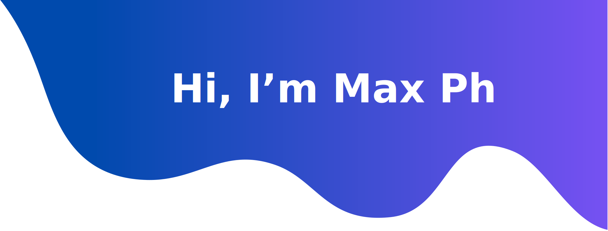

<h3 align="center">AI Researcher  </h3>

  <em>
    I am now a PhD researcher having passionated in <b>Machine Learning in Healthcare</b>  I eager to gain new knowledge daily </b>
  </em> 
   
   <b><i align="center">Thought : "Never Give up!”</i></b> 

 

<!--  -->
<!--  -->

###  ***About Me***
- 👋 I'm always eager to learn new things day by day
- 👯 I'm really interested in applying AI as well as IoT to address real world problems
- 🔭 I’m looking for a team to research and develop promising products :raising_hand:
- ⚡ Fun fact: I'm really into soccer and my favorite team is MU, still 🙂
 

### ***💻 Tech Stack***
                                     

### ***📊 GitHub Profile Stats***

|Github Stats | Top Languages |
|-------------|---------------|
|||
      

  
⚡ Recent Leetcode Activity

   
<!--     -->
   

<picture>
  <source media="(prefers-color-scheme: dark)" srcset="github-snake-dark.svg" />
  <source media="(prefers-color-scheme: light)" srcset="github-snake.svg" />
  
</picture>

  <i>Let's connect and chat! Open to anything under the sun.</i>

  

    	<code></code>
	<code></code>
	<code></code>
  

  

      
  

